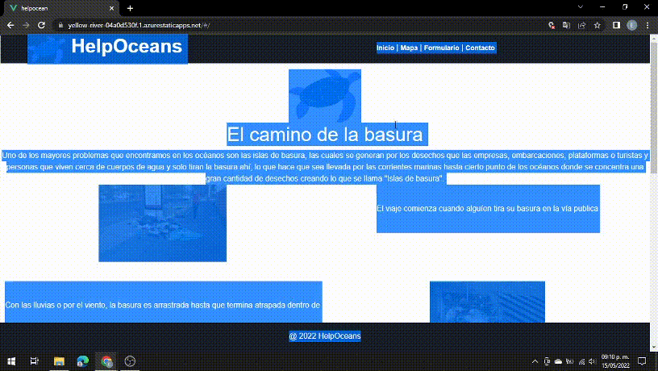

# HelpOceans
## Problemática 

Uno de los mayores problemas que encontramos en los océanos son las islas de basura, las cuales se generan por los desechos que las empresas, embarcaciones, plataformas o turistas y personas que viven cerca de cuerpos de agua y solo tiran la basura ahí, lo que hace que sea llevada por las corrientes marinas hasta cierto punto de los océanos donde se concentra una gran cantidad de desechos creando lo que se llama "Islas de basura". 

## Solución

Evitar que la basura llege a los océanos, esto sera posible, desarrollando una aplicación web, donde se haga conciencia del daño que causa tirar la basura en los océanos, se prodrá observar los daños que ya han causado en varios lugares del país, al igual que llene un formulario y darle una solución al desechar residuos, en lugar de que estos colaboren con el creciemiento de las islas de basura.

## Público objetivo

Empresario millenias que inicien una Startup, y produzcan desechos plásticos y estén dispuestos a adoptar medidas de reciclaje mediante un plan de negocios.

Personas de entre 18 a 35, sin importar el género.

## Buyer persona

Juan Perez, 25 años, trabaja en equipo de marketing de una starup.
Le teme a la catastrofe climatica.
Busca una manera directa de limpiar quitar basura en el oceano.

Fernanda Lemus, 18 años, estudiante de ingeniería.
Le preocupa la extinción de las especies por el plastico en el oceano.
Quiere ayudar pero no sabe como.

## Diagrama de solución


O puedes visitar la página de Miro para verlo de mejor manera: [Diagrama de solución](https://miro.com/app/board/uXjVO0qHyDI=/?share_link_id=173608525418)

## Maqueta de figma

En este enlace aparece la maqueta que se desarrollo para el frontend https://www.figma.com/file/vMA7Ph7mjFHcxSilUBXfbH/Untitled?node-id=5%3A41

Los que estan en 'wireframe' son los buenos.

## Tecnologias implementadas en el desarrollo

* En la parte de Front-end se utilizo Vue

* Control de versiones con git

* Api de Google Maps

* Booststrap

* Azure Static App 

# Link de la página desplegada en Azure

Aquí puedes acceder: [HelpOceans](https://yellow-river-04a0d530f.1.azurestaticapps.net/)

# Link del video de Tiktok

Aquí puedes conocer sobre el proyecto: [Tiktok HelpOceans](https://vm.tiktok.com/ZMLc39h9g/?k=1)

# Desarrollo del proyecto

Entre lo primero que se desarrollo fue el Front-end para el cual se uso los conocimientos proporcionados por el Mission Commander Rodrigo, ya que se uso la versión 3 de Vue, modificando y agregando los archivos necesarios para lo que se necesitaba. Al mismo tiempo se trabaja en el desarrollo del mapa usando una Api de Azure la cual nos permitia llamar a un mapa y colocar ciertas funciones dentro del mismo, como señalar las islas mas contaminadas de México y la isla de basura más cercana a nuestro país.

Luego de terminar de desarrollar esas partes, nos encontramos con un problema imprevisto, ya que el archivo que llamaba a la Api de Azure, al unirlo con Vue no lo acepta, ya que era necesario escribir el código que fuera capaz de interpretarlo. Se realizo una ardua investigación hasta encontrar un repositorio donde venía esa información, sin embargo esto no fue de ayuda, ya que los comandos que se daban eran para la versión 2 de Vue, por lo que se opto por reestructurar el proyecto con la versión necesaria.

De la misma manera la Mission Commander Fernanda nos aconsejo por cambiar la versión de 3 a 2, si eso no lo solucionaba, cambiar de tecnología y en lugar de Vue usar React, o en lugar de usar una Api de Azure ir por Google Maps, o hasta reestructurar todo el proyecto para que funcionara con Java.

Aunque parecía todo solucionado nos encontramos con un último problema, que la Api de Azure seguia sin ser compatible, ya que quedaba poco tiempo para la entrega fue necesario optar por un cambio lo cual llevo a usar un Api de Google maps, al mismo tiempo se seguía con el desarrollo de las demás ventanas del proyecto y la aplicación de los estilos, para lo cual se uso Booststrap.

Cabe mencionar que de la misma forma durante el desarrollo del proyecto contamos con otros problemas más externos, como problemas con los equipos de computo de algunos compañeros, por lo que fue necesario ir asignandoles otras tareas.

# Partes que componen el sitio



## Inicio 

En esta parte se podrá visualizar una pequeña historia de como la basura viaja hasta llegar a ser parte de una isla de basura, con la finalidad de concientizar a las personas de los daños que causan al contaminar los océanos, para que de esta manera se pueda observar como se esta impactando, y como afecta a nuestro planeta. La historia inicia desde donde nace una basura, que puede ser en cualquier parte del país o del mundo pero terminará en el mismo lugar siempre.


## Mapa

Aquí tendremos un mapa donde se mostrarán ciertos puntos, tales como algunas de las islas más contamidas, y de la misma forma el usuario podrá visualizar cierta información sobre esos sitios, para que puedan observar de una manera más real el daño que se a hecho a muchos lugares turisticos.


## Formulario 1

Los usuarios llenarán un formulario con la finalidad de saber que tanto llegarian a contribuir con las islas de basura si los desechos llegarán hasta ahí, dando una aproximación.

## Formulario 2

En este formulario los interesados colocarán sus datos de contacto para que nos comuniquemos con ellos y podamos darles una solución fiable y que no cause contaminación, reutilizando lo que se pueda dando como ejemplo algunos proyectos que ya existen, tales como la creación de pulseras con plásticos reciclados o incluso como lo que se nos presento por parte de los Mission Comanders donde se crean mouse de computadora a partir de productos reciclados.

## Integrantes del equipo

* Líder: Jesús Garrido Martínez
* Marco Rocha
* Erick Jamil Hernández
* Cesar Luilly García
* Emmanuel López 

## Project setup
```
npm install
```

### Compiles and hot-reloads for development
```
npm run serve
```

### Compiles and minifies for production
```
npm run build
```

### Customize configuration
See [Configuration Reference](https://cli.vuejs.org/config/).
